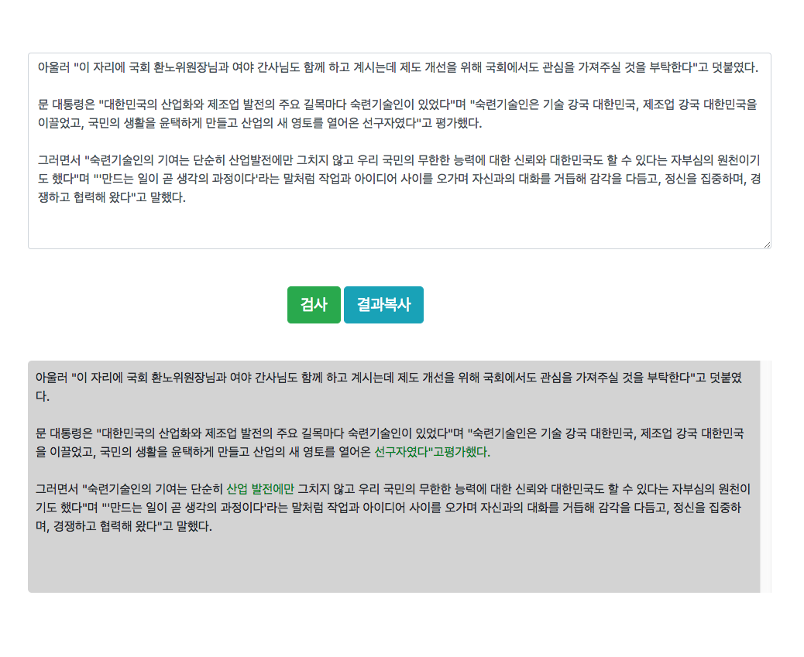

# spellChecker
맞춤법 검사기 JS 라이브러리 입니다.



### 필요한 파일
```
<script src="js/spellchecker.js"></script>
```

### 초기화
```
<script>
    var options = {
        "textarea": document.getElementById("textarea"),
        "submitBtn": document.getElementById("submitBtn"),
        "resultarea": document.getElementById("result"),
        "callback": function(data) {
            console.log(data);
        }
    };
    var spell = new spell(options);
    spell.init();
</script>
```

### 옵션
- textarea : 사용자가 문장을 입력하는 영역 (element)
- submitBtn : 검사 버튼
- resultarea : 맞춤법 검사 결과가 표시되는 영역
- callback : 맞춤법 검사 요청 후에 실행할 콜백 함수


### 기타 함수

##### 콜백 동적 설정
```
spell.setCallback(function(data) {
   // ... 내용
});
```

##### 콜백 원상 복귀
```
spell.resetCallback();
```

##### text로 직접 문법 검사하기 (결과 문장 리턴 받기)
```
var text = "아녕하세요";
var result;

spell.spellCheck(text);
result = spell.getResult(); // "<span class='re_red'>안녕하세요</span>"
```

##### Test URL
[Link](https://cdn.rawgit.com/writer0713/spellChecker/7c4be1cf/index.html)
